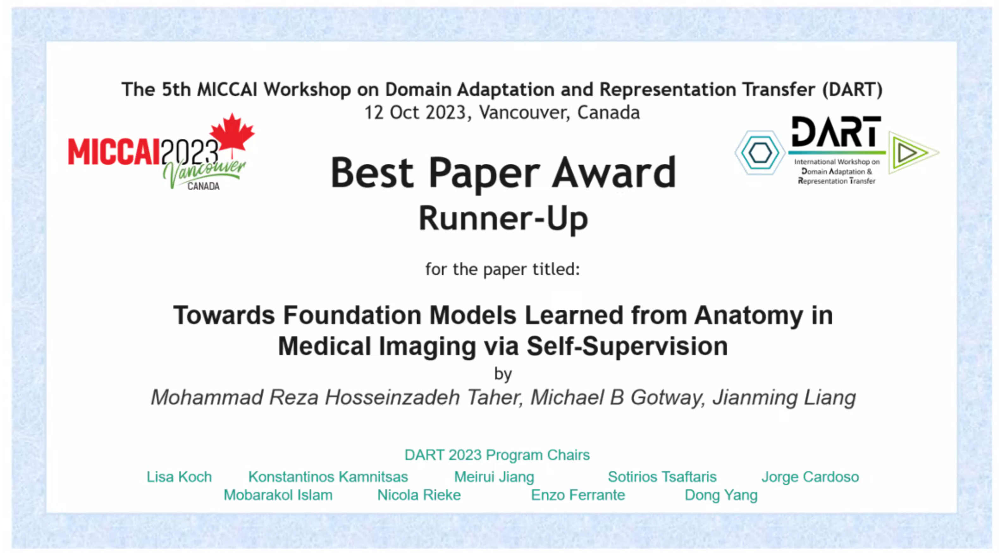
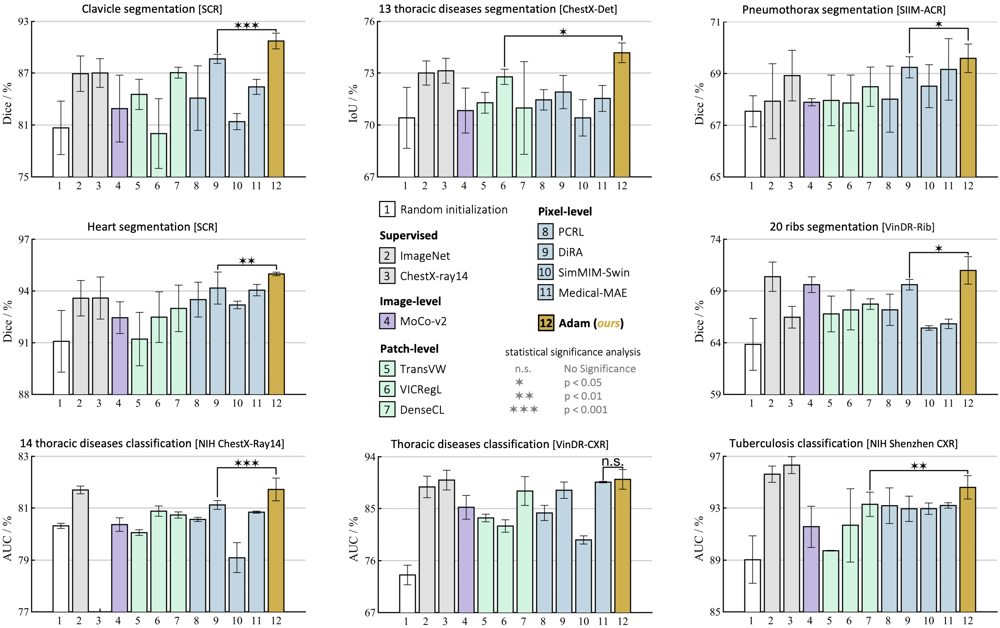
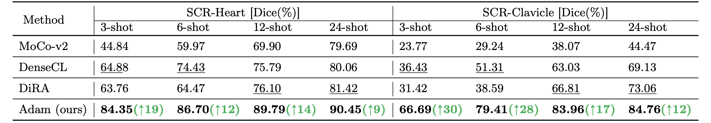
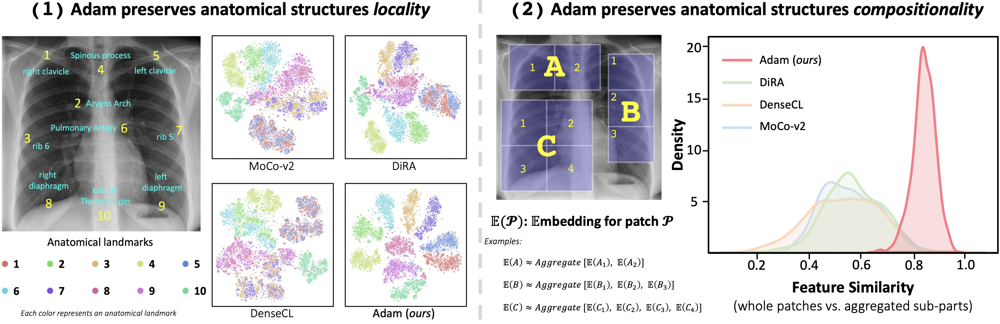
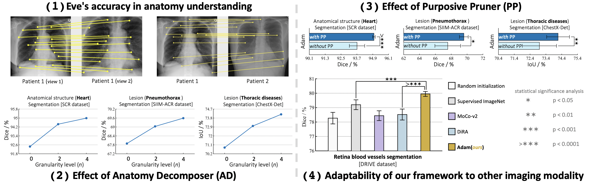

# Towards Foundation Models Learned from Anatomy in Medical Imaging via Self-Supervision

We devise a novel self-supervised learning (SSL) strategy that underpins the development of powerful models foundational to medical imaging via learning anatomy. Our approach not only generates **highly generalizable pretrained models** but also, in contrast to existing SSL methods, yields **dense anatomical embeddings** possessing essential properties of locality and compositionality, making them semantically meaningful for anatomy understanding.

 <div align="center">

##  <div align="center"> [ Click here to watch the paper presentation ](https://youtu.be/1ky57hn0aRg) </div>

</div>

<p align="center">  </p>

## Publication
### Towards Foundation Models Learned from Anatomy in Medical Imaging via Self-Supervision 

[Mohammad Reza Hosseinzadeh Taher](https://github.com/MR-HosseinzadehTaher)<sup>1</sup>, [Michael B. Gotway](https://www.mayoclinic.org/biographies/gotway-michael-b-m-d/bio-20055566)<sup>2</sup>, [Jianming Liang](https://chs.asu.edu/jianming-liang)<sup>1</sup><br/>
<sup>1 </sup>Arizona State University, <sup>2 </sup>Mayo Clinic <br/>
International Conference on Medical Image Computing and Computer Assisted Intervention ([MICCAI 2023](https://conferences.miccai.org/2023/en/)); <br/> Domain Adaptation and Representation Transfer <br/>

[Paper](https://arxiv.org/pdf/2309.15358.pdf) | [Code](https://github.com/MR-HosseinzadehTaher/Eden) | [Poster](http://www.cs.toronto.edu/~liang/Publications/) | [Oral Presentation](https://youtu.be/1ky57hn0aRg) 
:trophy: ${\color{red} {\textbf{Best Paper Award (Runner-up)}}}$ 

<br/>

:star: ${\color{blue} {\textbf{Please download the pretrained Adam PyTorch model as follow. }}}$


| Backbone | #Params. | Download |
|  ----  | ----  |  ----  |
| ResNet-50  | 25.6M | [Link](https://docs.google.com/forms/d/e/1FAIpQLSdHcnN6mLUEXebezyQZh3wE3u1RNtBBOpvjbQA8MNXXr9hdHQ/viewform?usp=sf_link) |


## Major results from our work

1. **Adam provides superior performance over fully/self-supervised methods.**
<br/>
<p align="center"></p>
<br/>

2. **Adam enhances annotation efficiency, revealing promise for few-shot learning.**
<br/>
<p align="center"></p>
<br/>

3. **Adam preserves locality and compositionality properties, which are intrinsic to anatomical structures and critical for understanding anatomy, in its embedding space.**
<br/>
<p align="center"></p>
<br/>

4. **Ablation studies on (1) Eve’s accuracy in anatomy understanding, (2) effect of anatomy decomposer, (3) effect of purposive pruner, and (4) adaptability of our framework to other imaging modalities.**
<br/>
<p align="center"></p>
<br/>

Credit to [superbar](https://github.com/scottclowe/superbar) by Scott Lowe for Matlab code of superbar.


## Requirements
+ Linux
+ Python
+ Install PyTorch ([pytorch.org](http://pytorch.org))


## Installation
Clone the repository and install dependencies using the following command:
```bash
$ git clone https://github.com/MR-HosseinzadehTaher/Eden.git
$ cd Eden-main/
$ pip install -r requirements.txt
```

## Self-supervised pretraining
### 1. Preparing data
We used traing set of ChestX-ray14 dataset for pretraining Adam ChestX-ray model, which can be downloaded from [this link](https://nihcc.app.box.com/v/ChestXray-NIHCC).

- The downloaded ChestX-ray14 should have a directory structure as follows:
```
ChestX-ray14/
    |--  images/ 
         |-- 00000012_000.png
         |-- 00000017_002.png
         ... 
```
We use 10% of training data for validation. We also provide the list of training and validation images in ``dataset/Xray14_train_official.txt`` and ``dataset/Xray14_val_official.txt``, respectively. The training set is based on the official split provided by ChestX-ray14 dataset. Training labels are not used during pretraining stage. The path to images folder is required for pretraining stage.

### 2. Pretraining Adam
This implementation only supports multi-gpu, DistributedDataParallel training, which is faster and simpler; single-gpu or DataParallel training is not supported. The instance discrimination setup follows [MoCo](https://github.com/facebookresearch/moco). The checkpoints with the lowest validation loss are used for fine-tuning. We do self-supervised pretraining using ResNet-50 backbone on ChestX-ray14 using 4 NVIDIA V100 GPUs.

We train Adam with three anatomical structure granulariy levels n={0,2,4}. For full training, run the provided script file (the path to training dataset must be updated throughout the run.sh file):

```bash
./run.sh
```

For pretraining the model with a particular data granularity level, we use the following command by specifying the value of n. For n>0, the path to pretrained model from previous stage should be provided. The following command is an example running command for training the model with n=4:
```bash
python -u main.py  /path/to/training/images --dist-url 'tcp://localhost:10002' --multiprocessing-distributed --world-size 1 --rank 0 --mlp --moco-t 0.2 --aug-plus --cos --exp_name n4  --epochs 200 --workers 16  --train_list dataset/Xray14_train_official.txt --val_list dataset/Xray14_val_official.txt --checkpoint-dir ./checkpoints  --weights ./checkpoints/n2/checkpoint.pth  --n 4 --sim_threshold 0.8 
```
Where ./checkpoints/n2/checkpoint.pth is the path to the checkpoint of the model pretrained with n=2.

## Fine-tuning Adam on downstream tasks
For downstream tasks, we use the code provided by recent [transfer learning benchmark](https://github.com/MR-HosseinzadehTaher/BenchmarkTransferLearning) in medical imaging. 

For classification tasks, a ResNet-50 encoder can be initialized with the pretrained encoder of Adam as follows:
```python
import torchvision.models as models

num_classes = #number of target task classes
weight = #path to Adam pretrained model
model = models.__dict__['resnet50'](num_classes=num_classes)
state_dict = torch.load(weight, map_location="cpu")
if "state_dict" in state_dict:
   state_dict = state_dict["state_dict"]
state_dict = {k.replace("module.", ""): v for k, v in state_dict.items()}
state_dict = {k.replace("backbone.", ""): v for k, v in state_dict.items()}
state_dict = {k.replace("encoder.", ""): v for k, v in state_dict.items()}
state_dict = {k.replace("encoder_q.", ""): v for k, v in state_dict.items()}
for k in list(state_dict.keys()):
   if k.startswith('fc'):
      del state_dict[k]
msg = model.load_state_dict(state_dict, strict=False)
print("=> loaded pretrained model '{}'".format(weight))
print("missing keys:", msg.missing_keys)
```

For segmentation tasks, a U-Net can be initialized with the pre-trained encoder of Adam as follows:
```python
import segmentation_models_pytorch as smp

backbone = 'resnet50'
weight = #path to Adam pre-trained model
model=smp.Unet(backbone)
state_dict = torch.load(weight, map_location="cpu")
if "state_dict" in state_dict:
   state_dict = state_dict["state_dict"]
state_dict = {k.replace("module.", ""): v for k, v in state_dict.items()}
state_dict = {k.replace("backbone.", ""): v for k, v in state_dict.items()}
state_dict = {k.replace("encoder.", ""): v for k, v in state_dict.items()}
state_dict = {k.replace("encoder_q.", ""): v for k, v in state_dict.items()}
for k in list(state_dict.keys()):
   if k.startswith('fc'):
      del state_dict[k]
msg = model.load_state_dict(state_dict, strict=False)
print("=> loaded pre-trained model '{}'".format(weight))
print("missing keys:", msg.missing_keys)

```


## Citation
If you use this code or use our pretrained weights for your research, please cite our paper:
```
@misc{taher2023foundation,
      title={Towards Foundation Models Learned from Anatomy in Medical Imaging via Self-Supervision}, 
      author={Mohammad Reza Hosseinzadeh Taher and Michael B. Gotway and Jianming Liang},
      year={2023},
      eprint={2309.15358},
      archivePrefix={arXiv},
      primaryClass={cs.CV}
}
```
## Acknowledgement
This research has been supported in part by ASU and Mayo Clinic through a
Seed Grant and an Innovation Grant, and in part by the NIH under Award
Number R01HL128785. The content is solely the responsibility of the authors
and does not necessarily represent the official views of the NIH. This work has
utilized the GPUs provided in part by the ASU Research Computing and in
part by the Bridges-2 at Pittsburgh Supercomputing Center through allocation
BCS190015 and the Anvil at Purdue University through allocation MED220025
from the Advanced Cyberinfrastructure Coordination Ecosystem: Services &
Support (ACCESS) program, which is supported by National Science Foundation
grants #2138259, #2138286, #2138307, #2137603, and #2138296. The content
of this paper is covered by patents pending.

## License

Released under the [ASU GitHub Project License](./LICENSE).

