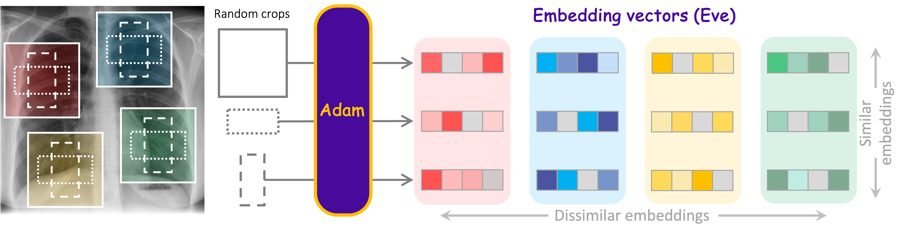
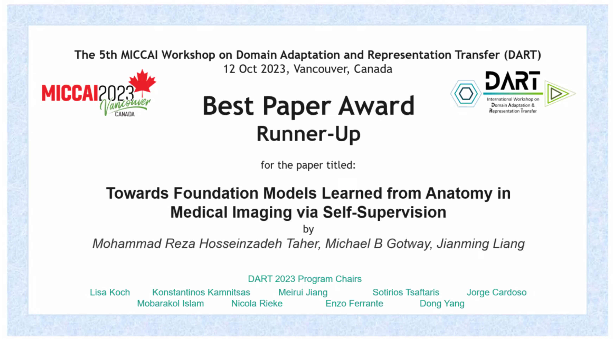

<p align="center"></p>

--------------------------------------------------------------------------------

We devise a novel self-supervised learning (SSL) framework that underpins the development of powerful models foundational to medical imaging via learning anatomy. Our approach not only generates **highly generalizable pretrained models, nicknamed Adam (autodidactic
dense anatomical models)** but also, in contrast to existing SSL methods, yields **dense anatomical embeddings, nicknamed Eve–v2 (embedding vectors)**, possessing essential properties of locality and compositionality, making them semantically meaningful for anatomy understanding.


<p align="center"></p>

## Publication

### Representing Part-Whole Hierarchies in Foundation Models by Learning Localizability, Composability, and Decomposability from Anatomy via Self-Supervision

[Mohammad Reza Hosseinzadeh Taher](https://github.com/MR-HosseinzadehTaher)<sup>1</sup>, [Michael B. Gotway](https://www.mayoclinic.org/biographies/gotway-michael-b-m-d/bio-20055566)<sup>2</sup>, [Jianming Liang](https://chs.asu.edu/jianming-liang)<sup>1</sup><br/>
<sup>1 </sup>Arizona State University, <sup>2 </sup>Mayo Clinic <br/>
IEEE/CVF Conference on Computer Vision and Pattern Recognition ([CVPR](https://cvpr.thecvf.com/))

[Paper](https://arxiv.org/pdf/) | [Code](https://github.com/MR-HosseinzadehTaher/Eden) | [Oral Presentation]()
${\color{red} {\textbf{Accepted at CVPR 2024 [main conference]}}}$

<br/>

:star: ${\color{blue} {\textbf{Please download the pretrained Adam-v2 PyTorch model as follow. }}}$


| Backbone | #Params. | Download |
|  ----  | ----  |  ----  |
| ConvNeXt-B | 89M | [Link](https://) |

### Towards Foundation Models Learned from Anatomy in Medical Imaging via Self-Supervision 

[Mohammad Reza Hosseinzadeh Taher](https://github.com/MR-HosseinzadehTaher)<sup>1</sup>, [Michael B. Gotway](https://www.mayoclinic.org/biographies/gotway-michael-b-m-d/bio-20055566)<sup>2</sup>, [Jianming Liang](https://chs.asu.edu/jianming-liang)<sup>1</sup><br/>
<sup>1 </sup>Arizona State University, <sup>2 </sup>Mayo Clinic <br/>
International Conference on Medical Image Computing and Computer Assisted Intervention ([MICCAI 2023](https://conferences.miccai.org/2023/en/)); <br/> Domain Adaptation and Representation Transfer <br/>

[Paper](https://arxiv.org/pdf/2309.15358.pdf) | [Code](https://github.com/MR-HosseinzadehTaher/Eden) | [Oral Presentation](https://youtu.be/1ky57hn0aRg) 
:trophy: ${\color{red} {\textbf{Best Paper Award (Runner-up)}}}$ 

<br/>

:star: ${\color{blue} {\textbf{Please download the pretrained Adam-v1 PyTorch model as follow. }}}$


| Backbone | #Params. | Download |
|  ----  | ----  |  ----  |
| ResNet-50  | 25.6M | [Link](https://docs.google.com/forms/d/e/1FAIpQLSdHcnN6mLUEXebezyQZh3wE3u1RNtBBOpvjbQA8MNXXr9hdHQ/viewform?usp=sf_link) |


 <div align="center">

##  <div align="center"> [ Click here to watch the paper presentation ](https://youtu.be/1ky57hn0aRg) </div>

</div>

<p align="center">  </p>


## Citation
If you use this code or use our pretrained weights for your research, please cite our paper:
```

@misc{taher2023foundation,
      title={Towards Foundation Models Learned from Anatomy in Medical Imaging via Self-Supervision}, 
      author={Mohammad Reza Hosseinzadeh Taher and Michael B. Gotway and Jianming Liang},
      year={2023},
      eprint={2309.15358},
      archivePrefix={arXiv},
      primaryClass={cs.CV}
}
```
## Acknowledgement
This research has been supported in part by ASU and Mayo Clinic through a
Seed Grant and an Innovation Grant, and in part by the NIH under Award
Number R01HL128785. The content is solely the responsibility of the authors
and does not necessarily represent the official views of the NIH. This work has
utilized the GPUs provided in part by the ASU Research Computing and in
part by the Bridges-2 at Pittsburgh Supercomputing Center through allocation
BCS190015 and the Anvil at Purdue University through allocation MED220025
from the Advanced Cyberinfrastructure Coordination Ecosystem: Services &
Support (ACCESS) program, which is supported by National Science Foundation
grants #2138259, #2138286, #2138307, #2137603, and #2138296. The content
of this paper is covered by patents pending.

## License

Released under the [ASU GitHub Project License](./LICENSE).

