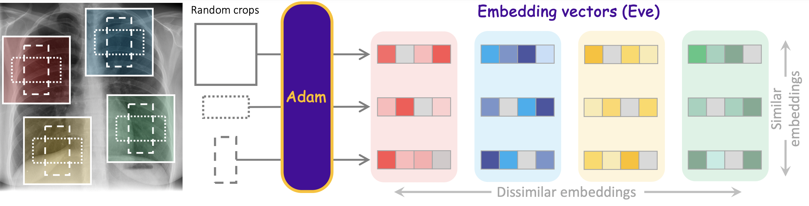
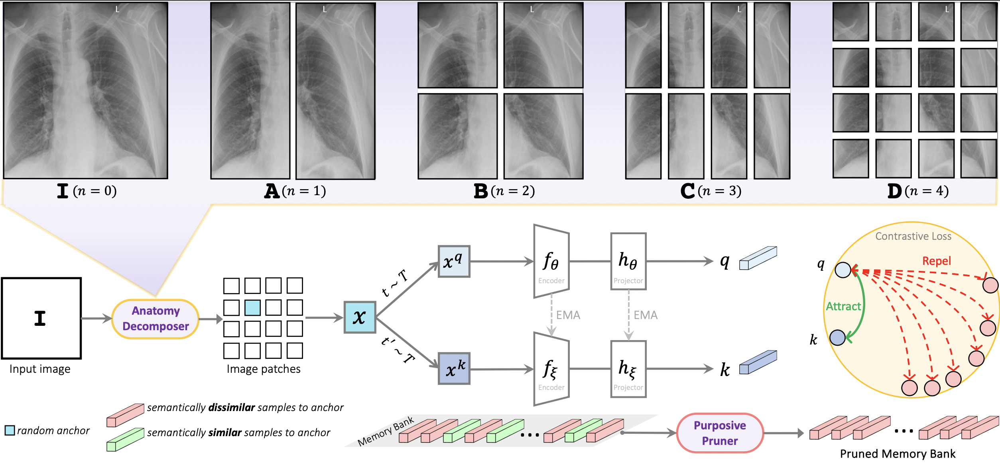
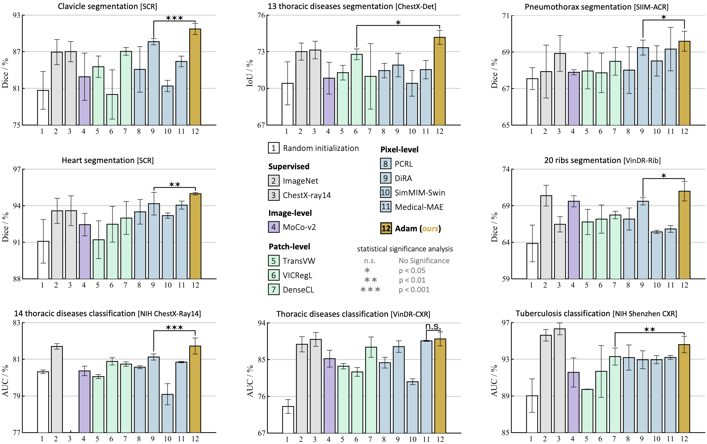
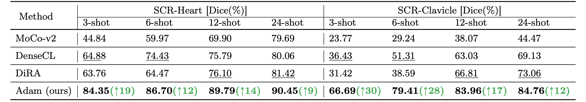
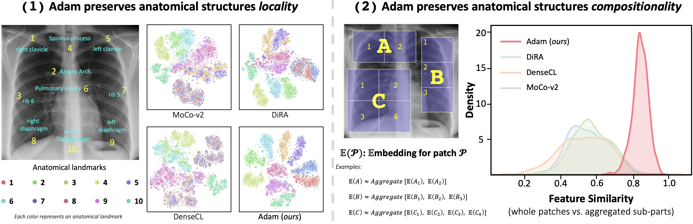
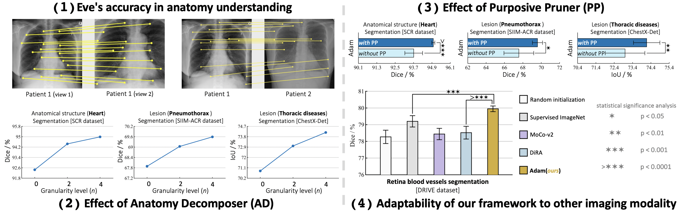

# Towards Foundation Models Learned from Anatomy in Medical Imaging via Self-Supervision

This repository provides a PyTorch implementation of the [Towards Foundation Models Learned from Anatomy in Medical Imaging via Self-Supervision](https://arxiv.org/pdf/2309.15358.pdf).

 <div align="center">

##  [ Watch the Paper Presentation ](https://youtu.be/1ky57hn0aRg) 

</div>


<p align="center">  </p>


Existing SSL methods lack capabilities of “understanding” the foundation of medical imaging—human anatomy. We believe that a foundation model must be able to transform each pixel in an image (e.g., a chest X-ray) into semantics-rich numerical vectors, called embeddings, where different anatomical structures (indicated by different colored boxes) are associated with different embeddings, and the same anatomical structures have (nearly) identical embeddings at all resolutions and scales (indicated by different box shapes) across patients. Inspired by the hierarchical nature of human anatomy, we introduce a novel SSL strategy to learn anatomy from medical images, resulting in embeddings **<span style="color:blue">(Eve)</span>**, generated by our pretrained model **<span style="color:blue">(Adam)</span>**, with such desired properties.

<br/>
<p align="center"></p>
<br/>


## Method

Our SSL strategy gradually decomposes and perceives the anatomy in a coarse-to-fine manner. Our **Anatomy Decomposer (AD)** decomposes the anatomy into a hierarchy of parts with granularity level $n \in {0,1,...}$ at each training stage. Thus, anatomical structures of finer-grained granularity will be incrementally presented to the model as the input. Given image $I$, we pass it to AD to get a random anchor $x$. We augment $x$ to generate two views (positive samples), and pass them to two encoders to get their features. To avoid semantic collision in training objective, our **Purposive Pruner** removes semantically similar anatomical structures across images to anchor $x$ from the memory bank. Contrastive loss is then calculated using positive samples’ features and the pruned memory bank. The figure shows pretraining at $n=4$.
<br/>
<p align="center"></p>
<br/>


## Major results from our work

1. **Adam provides superior performance over fully/self-supervised methods.**
<br/>
<p align="center"></p>
<br/>

2. **Adam enhances annotation efficiency, revealing promise for few-shot learning.**
<br/>
<p align="center"></p>
<br/>

3. **Adam preserves locality and compositionality properties, which are intrinsic to anatomical structures and critical for understanding anatomy, in its embedding space.**
<br/>
<p align="center"></p>
<br/>

4. **Ablation studies on (1) Eve’s accuracy in anatomy understanding, (2) effect of anatomy decomposer, (3) effect of purposive pruner, and (4) adaptability of our framework to other imaging modalities.**
<br/>
<p align="center"></p>
<br/>

Credit to [superbar](https://github.com/scottclowe/superbar) by Scott Lowe for Matlab code of superbar.


## Requirements
+ Linux
+ Python
+ Install PyTorch ([pytorch.org](http://pytorch.org))


## Installation
Clone the repository and install dependencies using the following command:
```bash
$ git clone https://github.com/MR-HosseinzadehTaher/Eden.git
$ cd Eden-main/
$ pip install -r requirements.txt
```

## Self-supervised pretraining
### 1. Preparing data
We used traing set of ChestX-ray14 dataset for pretraining Adam ChestX-ray model, which can be downloaded from [this link](https://nihcc.app.box.com/v/ChestXray-NIHCC).

- The downloaded ChestX-ray14 should have a directory structure as follows:
```
ChestX-ray14/
    |--  images/ 
         |-- 00000012_000.png
         |-- 00000017_002.png
         ... 
```
We use 10% of training data for validation. We also provide the list of training and validation images in ``dataset/Xray14_train_official.txt`` and ``dataset/Xray14_val_official.txt``, respectively. The training set is based on the official split provided by ChestX-ray14 dataset. Training labels are not used during pretraining stage. The path to images folder is required for pretraining stage.

### 2. Pretraining Adam
This implementation only supports multi-gpu, DistributedDataParallel training, which is faster and simpler; single-gpu or DataParallel training is not supported. The instance discrimination setup follows [MoCo](https://github.com/facebookresearch/moco). The checkpoints with the lowest validation loss are used for fine-tuning. We do self-supervised pretraining using ResNet-50 backbone on ChestX-ray14 using 4 NVIDIA V100 GPUs.

We train Adam with three anatomical structure granulariy levels n={0,2,4}. For full training, run the provided script file (the path to training dataset must be updated throughout the run.sh file):

```bash
./run.sh
```

For pretraining the model with a particular data granularity level, we use the following command by specifying the value of n. For n>0, the path to pretrained model from previous stage should be provided. The following command is an example running command for training the model with n=4:
```bash
python -u main.py  /path/to/training/images --dist-url 'tcp://localhost:10002' --multiprocessing-distributed --world-size 1 --rank 0 --mlp --moco-t 0.2 --aug-plus --cos --exp_name n4  --epochs 200 --workers 16  --train_list dataset/Xray14_train_official.txt --val_list dataset/Xray14_val_official.txt --checkpoint-dir ./checkpoints  --weights ./checkpoints/n2/checkpoint.pth  --n 4 --sim_threshold 0.8 
```
Where ./checkpoints/n2/checkpoint.pth is the path to the checkpoint of the model pretrained with n=2.

## Fine-tuning Adam on downstream tasks
For downstream tasks, we use the code provided by recent [transfer learning benchmark](https://github.com/MR-HosseinzadehTaher/BenchmarkTransferLearning) in medical imaging. 

For classification tasks, a ResNet-50 encoder can be initialized with the pretrained encoder of Adam as follows:
```python
import torchvision.models as models

num_classes = #number of target task classes
weight = #path to Adam pretrained model
model = models.__dict__['resnet50'](num_classes=num_classes)
state_dict = torch.load(weight, map_location="cpu")
if "state_dict" in state_dict:
   state_dict = state_dict["state_dict"]
state_dict = {k.replace("module.", ""): v for k, v in state_dict.items()}
state_dict = {k.replace("backbone.", ""): v for k, v in state_dict.items()}
state_dict = {k.replace("encoder.", ""): v for k, v in state_dict.items()}
state_dict = {k.replace("encoder_q.", ""): v for k, v in state_dict.items()}
for k in list(state_dict.keys()):
   if k.startswith('fc'):
      del state_dict[k]
msg = model.load_state_dict(state_dict, strict=False)
print("=> loaded pretrained model '{}'".format(weight))
print("missing keys:", msg.missing_keys)
```

For segmentation tasks, a U-Net can be initialized with the pre-trained encoder of Adam as follows:
```python
import segmentation_models_pytorch as smp

backbone = 'resnet50'
weight = #path to Adam pre-trained model
model=smp.Unet(backbone)
state_dict = torch.load(weight, map_location="cpu")
if "state_dict" in state_dict:
   state_dict = state_dict["state_dict"]
state_dict = {k.replace("module.", ""): v for k, v in state_dict.items()}
state_dict = {k.replace("backbone.", ""): v for k, v in state_dict.items()}
state_dict = {k.replace("encoder.", ""): v for k, v in state_dict.items()}
state_dict = {k.replace("encoder_q.", ""): v for k, v in state_dict.items()}
for k in list(state_dict.keys()):
   if k.startswith('fc'):
      del state_dict[k]
msg = model.load_state_dict(state_dict, strict=False)
print("=> loaded pre-trained model '{}'".format(weight))
print("missing keys:", msg.missing_keys)

```


## Citation
If you use this code or use our pretrained weights for your research, please cite our paper:
```
@misc{taher2023foundation,
      title={Towards Foundation Models Learned from Anatomy in Medical Imaging via Self-Supervision}, 
      author={Mohammad Reza Hosseinzadeh Taher and Michael B. Gotway and Jianming Liang},
      year={2023},
      eprint={2309.15358},
      archivePrefix={arXiv},
      primaryClass={cs.CV}
}
```
## Acknowledgement
This research has been supported in part by ASU and Mayo Clinic through a
Seed Grant and an Innovation Grant, and in part by the NIH under Award
Number R01HL128785. The content is solely the responsibility of the authors
and does not necessarily represent the official views of the NIH. This work has
utilized the GPUs provided in part by the ASU Research Computing and in
part by the Bridges-2 at Pittsburgh Supercomputing Center through allocation
BCS190015 and the Anvil at Purdue University through allocation MED220025
from the Advanced Cyberinfrastructure Coordination Ecosystem: Services &
Support (ACCESS) program, which is supported by National Science Foundation
grants #2138259, #2138286, #2138307, #2137603, and #2138296. The content
of this paper is covered by patents pending.

## License

Released under the [ASU GitHub Project License](./LICENSE).

